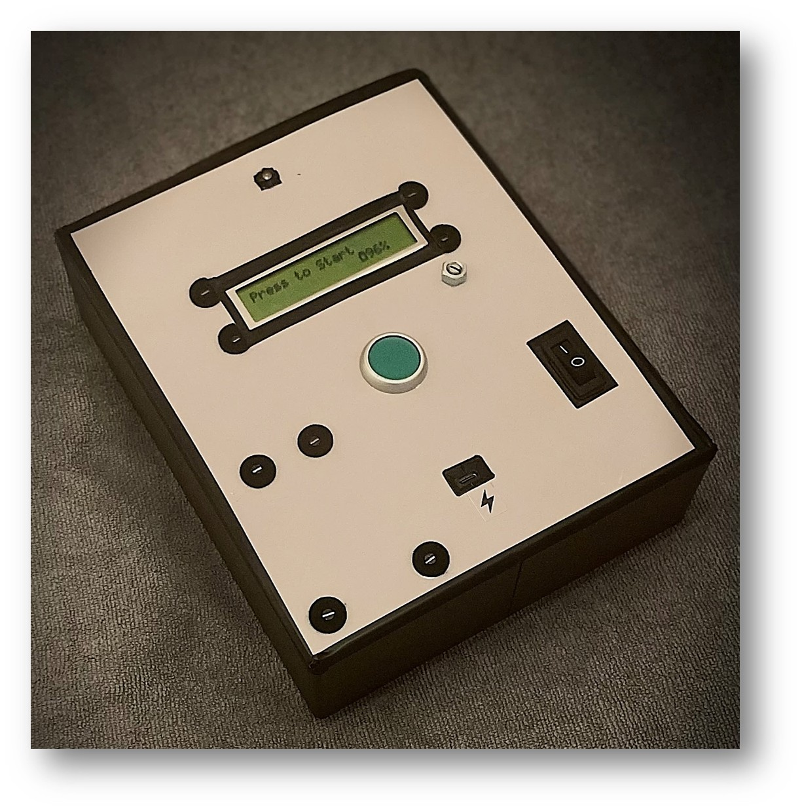
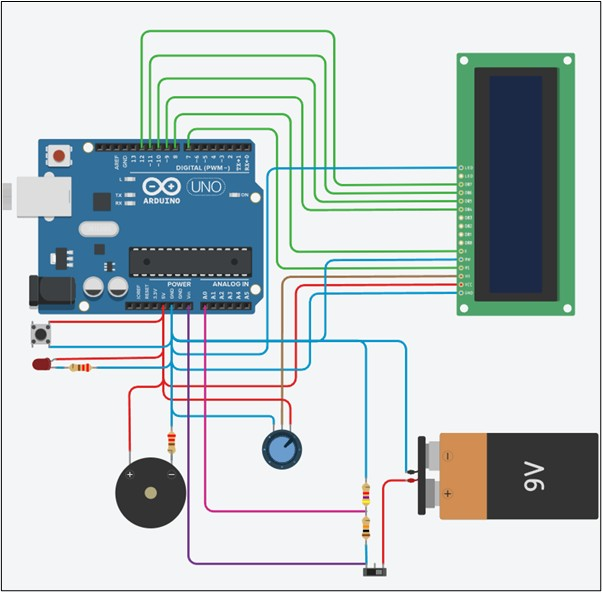
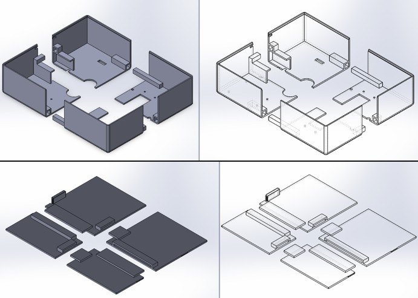

# 🛑 5 Second Stop Rig – Reaction Timer Project

A precision-based embedded system built using Arduino to challenge users to stop a timer at **exactly 5.00 seconds**. Designed as part of my final year Mechatronics Engineering project, this rig blends real-time feedback, control logic, and human interaction.

## 🔧 Features

- 0.01s resolution reaction timer
- Real-time LCD feedback
- LED + buzzer indicators on success/failure
- Resettable with push-button interface
- Fully self-contained 3D-printed rig

## ⚙️ Technologies Used

- **Microcontroller**: Arduino Uno  
- **Language**: Embedded C++ (Arduino IDE)  
- **Components**: LCD, push button, buzzer, LED, resistors, 3D-printed enclosure  
- **Software**: Arduino IDE, SolidWorks (enclosure design), Tinkercad (circuit simulation)
📄 [View the Arduino Source Code](./5SecondStop.ino)

## 🖼️ Photos

### 🔧 Final Build  
*3D-printed enclosure with LCD, buzzer, and control button.*  

---

### 📊 Circuit Diagram  
*Breadboard schematic showing component connections and layout .*  

---

### 🧩 CAD Design  
*SolidWorks enclosure model for housing the entire system (split into 4 parts due to 3D printer dimension limitations).*  

## 🎥 Demo Video

Watch it in action:  
➡️ [Demo Video – 5 Second Stop Rig (YouTube Short)](https://youtube.com/shorts/lqYZ7MV_RtU?feature=shared)

## 🧠 How It Works

1. Press the start button to begin the timer.  
2. The LCD displays time in real-time.  
3. Try to stop the timer at exactly **5.00 seconds**.  
4. Success triggers a buzzer melody + LED. Failure plays a different tone.  
5. Device resets automatically and displays battery level on LCD.

## 📘 What I Learned

- Real-time embedded programming  
- Signal debouncing and input handling  
- LCD interfacing and timing precision  
- Hardware-software debugging and feedback design  
- Multidisciplinary integration (CAD + embedded logic)

## 👨‍💻 Built By

Ivan McCauley — Mechatronics Engineering Graduate  
[LinkedIn](https://www.linkedin.com/in/ivan-mccauley-82b17a177)
